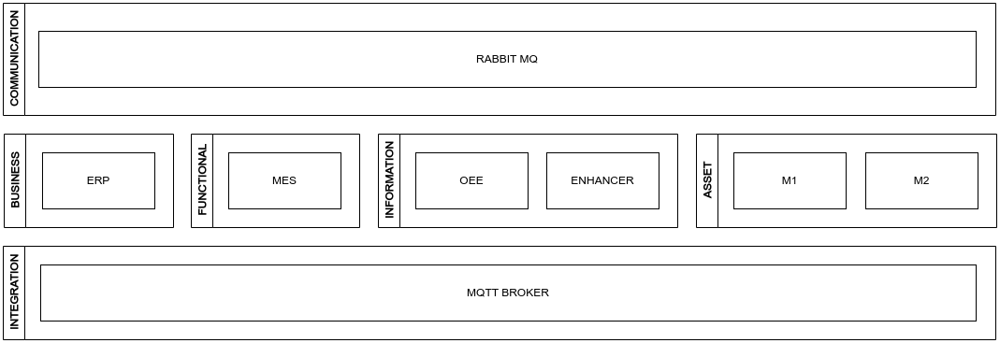

# RAMI 4.0

Esse repositório utliza o docker-compose para simular um ambiente fabril seguindo o modelo RAMI4.0

|COMPONENTE|LAYER|PORTA|
|---|---|---|
|**RABBIT MQ**|COMMUNICATION|5672|
|**RABBIT MQ**|COMMUNICATION|15672|
|**MYSQL**|INFORMATION|3306|
|**MOSQUITTO**|INTEGRATION|1883|
|**MOSQUITTO**|INTEGRATION|9001|
|**M1**|ASSET|5001|
|**M2**|ASSET|5002|
|**ERP**|BUSINESS|8080|
|**MES**|FUNCTIONAL|8081|
|**OEE**|INFORMATION|8082|
|**ENHANCER**|INFORMATION|8083|

## ASSET LAYER
## INTEGRATION LAYER
## COMMUNICATION
## INFORMATION
## FUNCTIONAL
## BUSINESS
